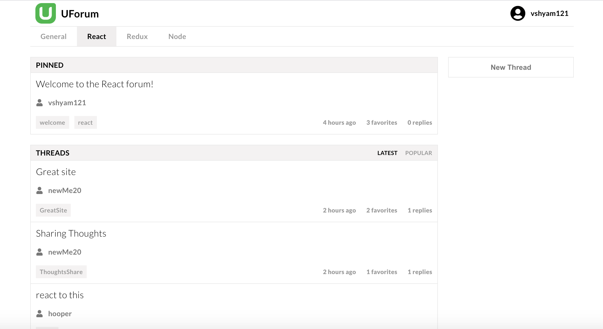

## Portfolio

---

<a href="https://uforum-app.herokuapp.com">UForum</a>
* Designed and implemented a full stack responsive forum discussion web application.

* Frontend is React.js/Redux based. Developed reusable components from scratch using Sass and Flex box. 

* Application lets users/admins create, favorite, delete and reply to discussion threads with admins having more control.

* Backend is Node.js/Express based. Developed a RESTful API and interfaces with MongoDB.
  

  
<a href="https://github.com/vshyam121/uforum">View frontend code</a>
  
<a href="https://github.com/vshyam121/uforum-api">View backend code</a>

---

[PizzaTime](/pizza-time)
* Designed and implemented a full stack responsive e-commerce web application that lets users customize and buy various types of pizzas based on toppings, crust type, size, etc.

* Frontend is React.js/Redux based. Developed reusable components from scratch using Sass, Flex box and CSS Grid. 

* Application is complete with shopping cart, sign up/sign in, delivery/carryout orders, and view past orders functionality.

* Backend is Node.js/Express based. Developed a RESTful API and interfaces with MongoDB.
  

  
<a href="https://github.com/vshyam121/pizza-time">View frontend code</a>
  
<a href="https://github.com/vshyam121/pizza-time-api">View backend code</a>

---
